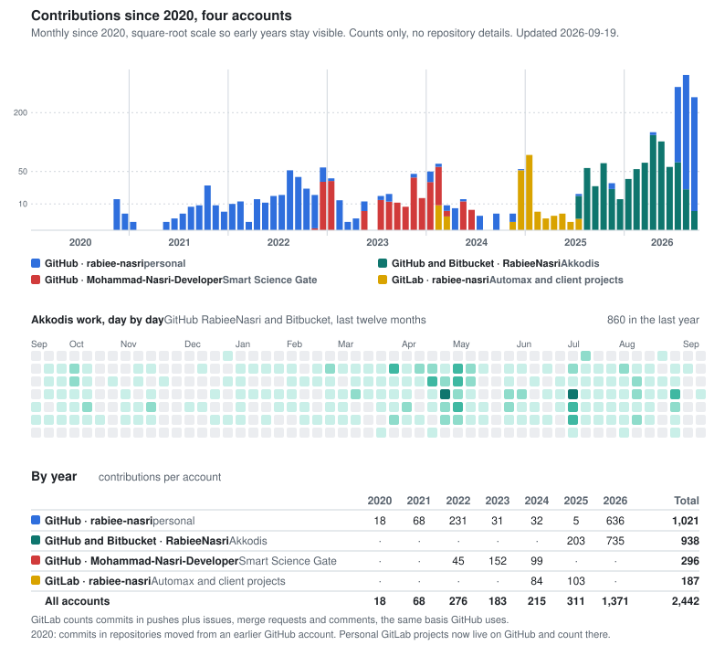

## Rabiee Nasri

Senior Application Engineer (mobile) at Akkodis, Dubai. Seven years building Flutter and native mobile apps for e-commerce, delivery and subscription platforms.

Most of my production work is closed-source client work: a large-scale retail and quick-commerce app for a Sharjah government entity, and a three-app kids subscription platform with 10M+ downloads. What I can share publicly, I write up.

**Site and writing:** https://rabieenasri.com

- [Automating Mobile App Regression: Overnight Testing and Evidence-Based Releases](https://www.akkodis.com/en/blog/articles/automating-mobile-app-regression-overnight-testing), on the Akkodis blog
- [Flutter Monorepo Architecture with Melos](https://rabieenasri.com/posts/flutter-monorepo-architecture)
- [A Mobile Test Automation Practice, from Zero](https://rabieenasri.com/posts/mobile-test-automation-practice)
- [Flutter Platform Channels: Native SDKs in Production](https://rabieenasri.com/posts/flutter-platform-channels-native-sdks)
- [Device Integrity in Flutter: Play Integrity and App Attest](https://rabieenasri.com/posts/flutter-play-integrity-app-attest)
- [Provider to Riverpod: What 15,000 Lines Actually Bought Us](https://rabieenasri.com/posts/provider-to-riverpod-migration)

**Stack:** Flutter, Dart, Kotlin, Swift, platform channels, Melos and pub workspaces, Riverpod, go_router, CI/CD, automated end-to-end testing with Maestro.

**Contact:** hello@rabieenasri.com · [LinkedIn](https://www.linkedin.com/in/m-r-nasri) · [Stack Overflow](https://stackoverflow.com/users/13470875/m-nasri)

### Contributions across accounts

Client work is committed from my Akkodis account, [@RabieeNasri](https://github.com/RabieeNasri), in private repositories, and since August 2026 also on Bitbucket, which has no public activity feed, so those are counted from my own clones. My earlier work account, [@Mohammad-Nasri-Developer](https://github.com/Mohammad-Nasri-Developer), covers Smart Science Gate, 2022 to 2024. My Automax work, October 2024 to July 2025, is on [GitLab](https://gitlab.com/rabiee-nasri); my personal projects from 2021 to 2025 started there and now live here as private repositories with their full history. Counts only; the client repositories stay private.

<picture>
  <source media="(prefers-color-scheme: dark)" srcset="assets/contributions-dark.svg">
  
</picture>
